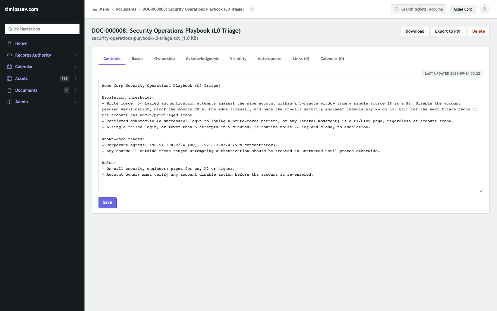
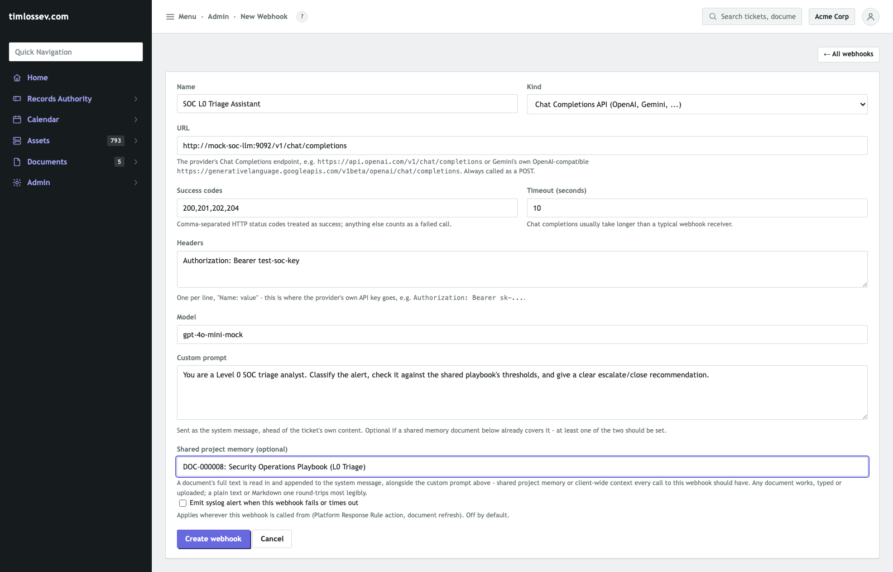
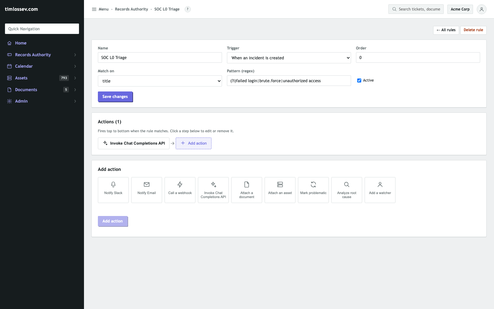
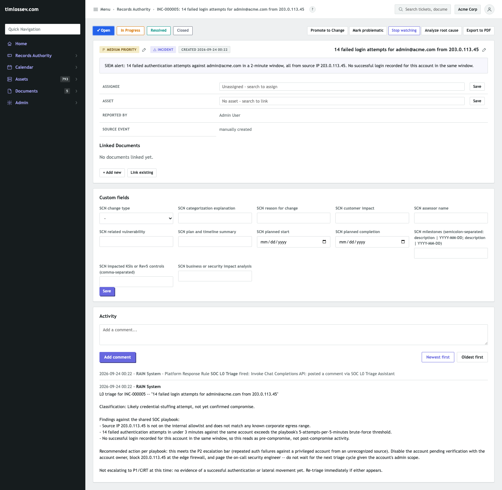

# AI-assisted L0 triage showcase

RAIN's Chat Completions API webhook and its matching Platform Response
Rule action (**Invoke Chat Completions API**) let any OpenAI-compatible
provider (OpenAI, Gemini's own compatibility endpoint, a self-hosted
model behind the same API shape) triage a ticket the moment it's
created -- before a human ever opens it. This walks through the
scenario that motivated it: Level 0 triage of an incoming security
alert against a SOC's own written playbook, end to end against a live
instance. The provider itself is a small mock server here (a real API
key costs real money per call, and the point is to show RAIN's own
side of the integration), but every other part -- the webhook config,
the Platform Response Rule, the real HTTP request it sends, the
comment it posts back -- is exactly what a real OpenAI/Gemini call
produces. See
[`docs/compliance-templates/README.md`](compliance-templates/README.md)'s
"Significant Change Notification export" section and
[`docs/architecture.md`](architecture.md) for the underlying
mechanism's own design notes.

## 1. The shared platform context document

A Level 0 analyst doesn't triage from the alert text alone -- they
check it against the team's own written playbook: escalation
thresholds, known-good IP ranges, who gets paged. That playbook is
just a Document in RAIN, typed in directly:



Nothing special about this document -- it's the same Documents
feature every other register in this app uses, with its own tabs
(Basics, Ownership, Acknowledgment, Visibility), version history, and
PDF export. What makes it "shared platform context" is only that a
webhook is about to point at it.

## 2. The Chat Completions webhook

Admin > Webhooks > New webhook, kind **Chat Completions API**:



The URL is the provider's own Chat Completions endpoint (a mock
server standing in for `https://api.openai.com/v1/chat/completions`
here); Headers carries the provider's API key, same as any other
webhook's `Authorization` header. What's specific to this kind: a
**Model** name, a free-form **Custom prompt** ("You are a Level 0 SOC
triage analyst..."), and the playbook document picked as **Shared
project memory** via the same type-to-search picker every other
document reference in RAIN uses. At call time, the custom prompt and
the memory document's full text are concatenated into one system
message -- the model sees both, every time, without either being
re-typed into the other.

## 3. The Platform Response Rule

Records Authority > Platform Response Rules: a rule firing on
**When an incident is created**, matching titles that look like an
auth-alert (`(?i)failed login|brute.force|unauthorized access`), with
one action:



Picking the action type shows every webhook this tenant has, labeled
by kind (`SOC L0 Triage Assistant (Chat Completions API)`) -- picking
a Generic one here is rejected at save time with a clear reason
instead of failing silently the first time the rule actually fires
(a real gap this feature had, caught by a code review of this exact
feature and fixed before this showcase was written).

## 4. A real alert, triaged before anyone looked at it

A SIEM-shaped incident ticket, created the normal way (Records
Authority > New ticket -- in practice this would arrive via the
syslog listener and Event Promotion Policies, same as any other
auto-promoted ticket):

> **14 failed login attempts for admin@acme.com from 203.0.113.45**
> SIEM alert: 14 failed authentication attempts against
> admin@acme.com in a 2-minute window, all from source IP
> 203.0.113.45. No successful login recorded for this account in the
> same window.

The rule matched on creation and fired immediately:



The comment is the ticket's first activity entry, right after the
"Platform Response Rule SOC L0 Triage fired" log line -- before any
human commented, assigned, or even opened it. It didn't just restate
the alert; it checked the specific numbers against the playbook's own
thresholds (14 attempts against the 5-per-5-minutes bar, the source IP
against the known-good ranges), reached a classification, and named a
concrete next action with a reason to *not* escalate further yet. The
real HTTP request sent to get this (captured from the mock provider's
own log, not reconstructed) shows exactly what made it in:

```json
{
  "model": "gpt-4o-mini-mock",
  "messages": [
    {
      "role": "system",
      "content": "You are a Level 0 SOC triage analyst. Classify the alert, check it against the shared playbook's thresholds, and give a clear escalate/close recommendation.\n\nAcme Corp Security Operations Playbook (L0 Triage)\n\nEscalation thresholds:\n- Brute force: 5+ failed authentication attempts ...(the full playbook text)..."
    },
    {
      "role": "user",
      "content": "Ticket: INC-000005\nType: incident\nTitle: 14 failed login attempts for admin@acme.com from 203.0.113.45\nSeverity: medium\nStatus: open\n\nDescription:\nSIEM alert: 14 failed authentication attempts against admin@acme.com in a 2-minute window, all from source IP 203.0.113.45. No successful login recorded for this account in the same window."
    }
  ]
}
```

The custom prompt and the playbook's full text landed in the same
system message, in that order; the ticket's own fields -- built by
`rain.modules.webhooks.service._ticket_payload_text`, the same
function regardless of provider -- landed in the user message
untouched.

## Where this helps, and where it doesn't

This is Level 0 triage, not Level 1 response. It's well suited to:
turning a raw alert into a classification and a recommended action
within seconds of ticket creation, consistently applying the same
written playbook an analyst would otherwise have to remember or look
up by hand, and giving the human who picks up the ticket a documented
starting point instead of a blank one. It is not: an autonomous
responder (nothing here disables the account, blocks the IP, or pages
anyone -- the comment *recommends* those actions, a human or a
separate automation still has to take them), a replacement for the
playbook itself (the model can misread it, same as a tired analyst
can -- treat the comment as a first pass, not a verdict), or aware of
anything not in the ticket's own fields and the memory document (no
live threat-intel lookup, no history of this account's prior
activity, unless that's added to the payload or the memory document
itself).

## Reproducing this

1. Write (or paste) your team's own triage playbook as a Document --
   plain text or Markdown round-trips most legibly.
2. Admin > Webhooks > New webhook, kind Chat Completions API: your
   real provider's endpoint and API key (in Headers, as
   `Authorization: Bearer ...`), a model name, a custom prompt, and
   the playbook document as shared memory.
3. Records Authority > Platform Response Rules > New rule, trigger
   "When an incident is created" (or vulnerability/change), a pattern
   matching the alerts you want triaged; add the "Invoke Chat
   Completions API" action and pick the webhook.
4. Create (or let a syslog-promoted) matching ticket arrive -- the
   triage comment appears within a few seconds, before anyone opens
   it.
