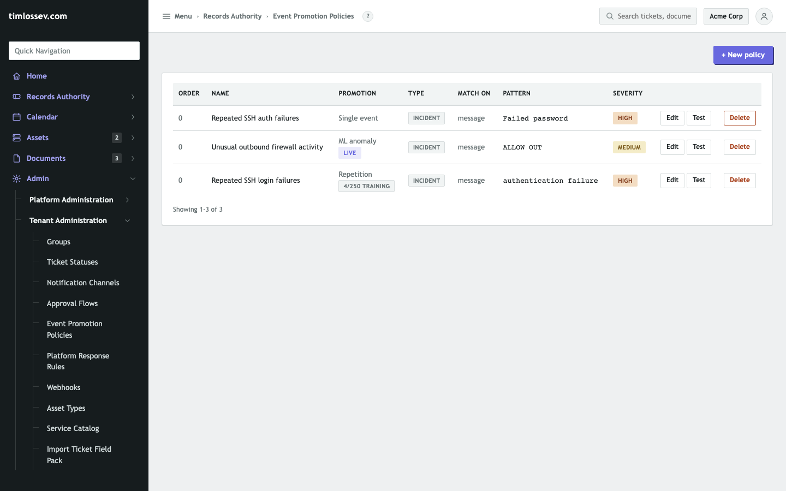
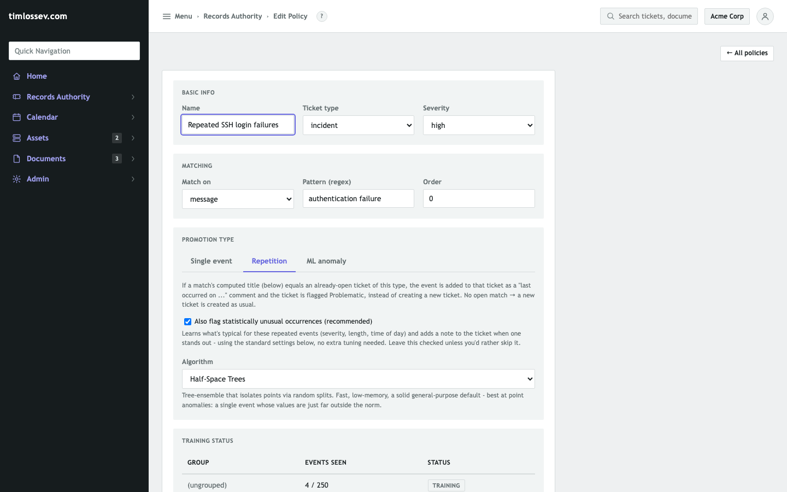
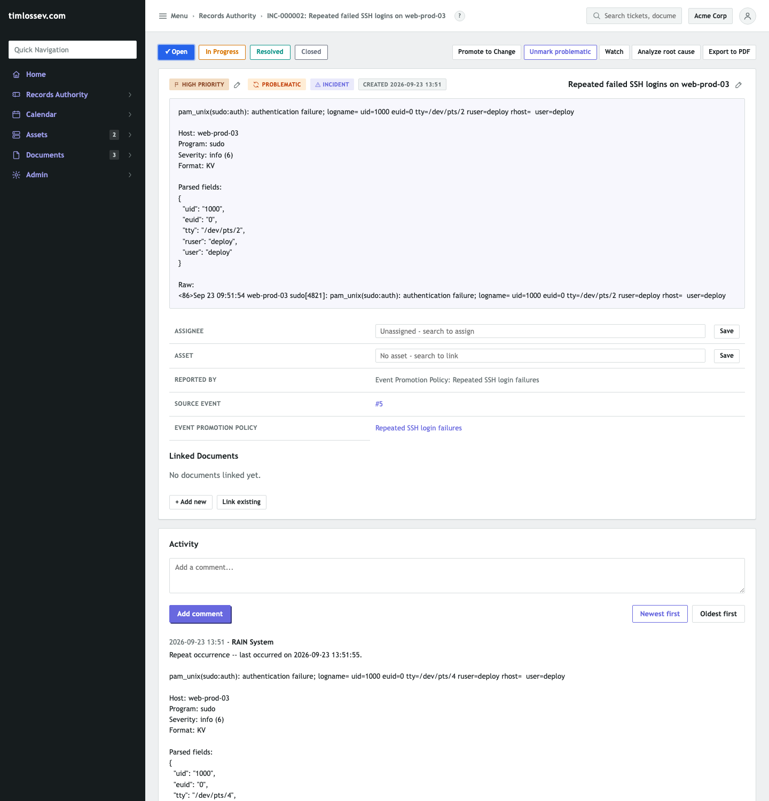
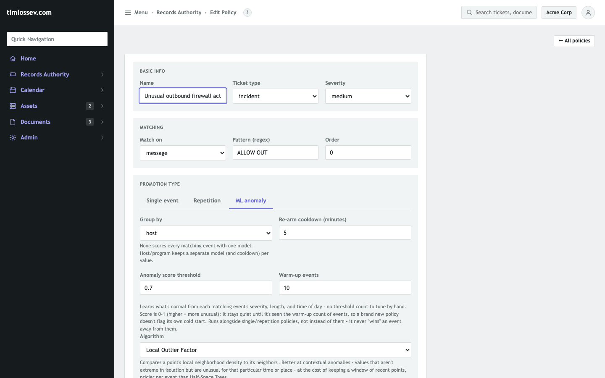
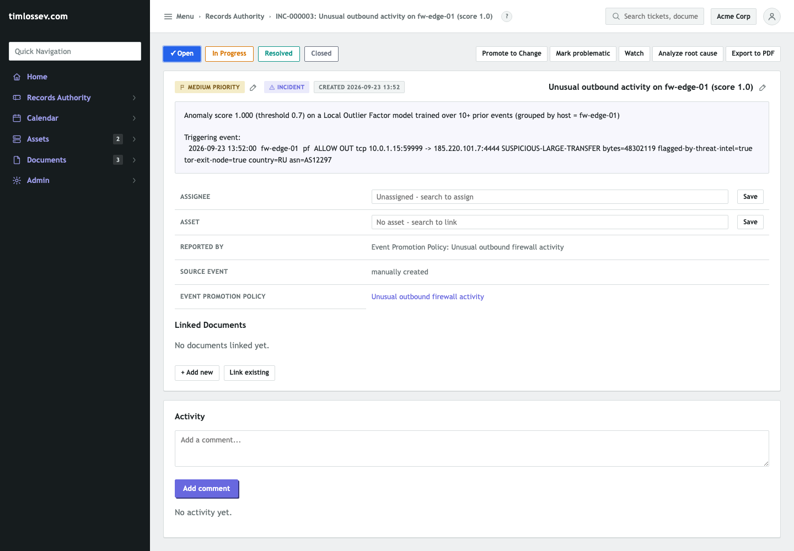

# Event correlation showcase

RAIN's **Event Promotion Policies** (Records Authority > Event Promotion
Policies) decide whether an incoming syslog event becomes a ticket, gets
folded into one that's already open, or just sits in the event feed
untouched. There are three promotion types, and they aren't mutually
exclusive -- a policy is one of "Single event" or "Repetition" (first
match wins, so an event never spawns two tickets that way), plus any
number of "ML anomaly" policies can score the same event independently
on top of that. This page walks through two of them against real events
sent to a local instance -- nothing here is mocked up, screenshots
included. See [`docs/architecture.md`](architecture.md)'s Ticketing
section for the underlying implementation
(`rain.modules.tickets.rules`).

## 1. Repetition: folding repeats into one ticket

A **Repetition** policy computes a title from the matching event (here,
`Repeated failed SSH logins on {host}`). The first matching event opens
a new ticket as usual. Every later event that computes the *same* title
against a still-open ticket of that type gets folded into it instead of
opening a duplicate -- added as a "Repeat occurrence" comment, with the
ticket flagged **Problematic** so it's visible at a glance on any ticket
list without reading every comment.



The policy list shows all three promotion types side by side: a
pre-existing "Single event" policy, this "Repetition" policy, and the
"ML anomaly" policy from part 2 below (already showing **LIVE**, having
cleared its warm-up).



Configuration: match on `message` against the regex `authentication
failure`, promotion type Repetition. "Also flag statistically unusual
occurrences" is checked -- it's on by default for a new policy, and
left on here -- which runs an independent anomaly sidecar over this
same repeated-event group (severity, message length, time of day) so
that a stream of otherwise-routine repeats can still surface the one
that's genuinely unusual. Its own training status table shows 4 of the
250 events it needs to build a baseline.

Four synthetic `sudo` PAM auth-failure events were sent over the
syslog listener (`nc localhost 5514`, RFC 3164 framing), all from host
`web-prod-03`:

```
<86>Sep 23 09:51:54 web-prod-03 sudo[4821]: pam_unix(sudo:auth): authentication failure; ...
<86>Sep 23 09:51:55 web-prod-03 sudo[4833]: pam_unix(sudo:auth): authentication failure; ...
<86>Sep 23 09:51:56 web-prod-03 sudo[4841]: pam_unix(sudo:auth): authentication failure; ...
<86>Sep 23 09:51:57 web-prod-03 sudo[4855]: pam_unix(sudo:auth): authentication failure; ...
```

The first opened `INC-000002`; the next three each computed the same
title against that still-open ticket and folded in instead of opening
their own:



`HIGH PRIORITY` / `PROBLEMATIC` / `INCIDENT`, "Reported by: Event
Promotion Policy: Repeated SSH login failures," and three "Repeat
occurrence -- last occurred on ..." comments in the activity feed below
(one per folded-in event, each carrying that event's own parsed KV
fields and raw line) -- one ticket instead of four, with the full
history preserved rather than discarded.

## 2. ML anomaly: scoring events against a learned baseline

An **ML anomaly** policy never competes with Single/Repetition for an
event -- every active ML policy scores every event that matches its own
pattern, independently, and fires once its score clears its threshold.
No threshold *count* to tune by hand: it learns what's typical (event
severity, message length, time of day) from the events it's already
seen, scores each new one against that baseline (0-1, higher = more
unusual), and stays quiet until it's seen its configured warm-up count
-- so a brand-new policy doesn't flag its own cold start as one big
anomaly.



Configuration: match on `message` against `ALLOW OUT` (a firewall
allow-rule log line), grouped by `host` (a separate model per host
rather than one shared model), Local Outlier Factor as the algorithm
(better than the default Half-Space Trees at this kind of small-sample
demo -- see the field's own hint text for the actual trade-off:
contextual anomalies vs. raw speed/memory), a warm-up of 10 events, and
the default 0.7 anomaly-score threshold.

Ten routine firewall lines were sent first, all from host `fw-edge-01`,
constant severity and near-constant length:

```
<134>Sep 23 ... fw-edge-01 pf[300]: ALLOW OUT tcp 10.0.1.15:51000 -> 93.184.216.34:443
<134>Sep 23 ... fw-edge-01 pf[300]: ALLOW OUT tcp 10.0.1.15:51001 -> 93.184.216.34:443
... (8 more, same shape)
```

Then one distinctly different line -- higher severity, a much longer
message, and content that reads as suspicious on its own:

```
<130>Sep 23 ... fw-edge-01 pf[300]: ALLOW OUT tcp 10.0.1.15:59999 -> 185.220.101.7:4444 SUSPICIOUS-LARGE-TRANSFER bytes=48302119 flagged-by-threat-intel=true tor-exit-node=true country=RU asn=AS12297
```

The ten baseline events all scored 0.0 against the model as it was
still being built (and wouldn't have fired regardless -- the warm-up
count hadn't been reached yet). The eleventh, scored against a baseline
now established from those ten, cleared the threshold and fired:



The ticket's own description states exactly what fired and why:
"Anomaly score 1.000 (threshold 0.7) on a Local Outlier Factor model
trained over 10+ prior events (grouped by host = fw-edge-01)," followed
by the triggering event's full text -- an assessor (or an on-call
engineer at 3am) doesn't have to trust the score, they can see the
input it was computed from.

## Reproducing this

1. Admin > Syslog Listener: add a routing rule (`host` matches `.*`,
   regex) pointing at your tenant, if one isn't already configured.
2. Records Authority > Event Promotion Policies > New policy: build the
   two policies above (or your own pattern/promotion-type combination).
3. Feed it real or synthetic RFC 3164 lines on the syslog listener port
   (`5514` by default, TCP or UDP, newline-delimited):
   `printf '<86>...\n' | nc localhost 5514`.
4. Watch Records Authority > Events (live) as they arrive, or jump
   straight to the resulting ticket once a policy fires.
