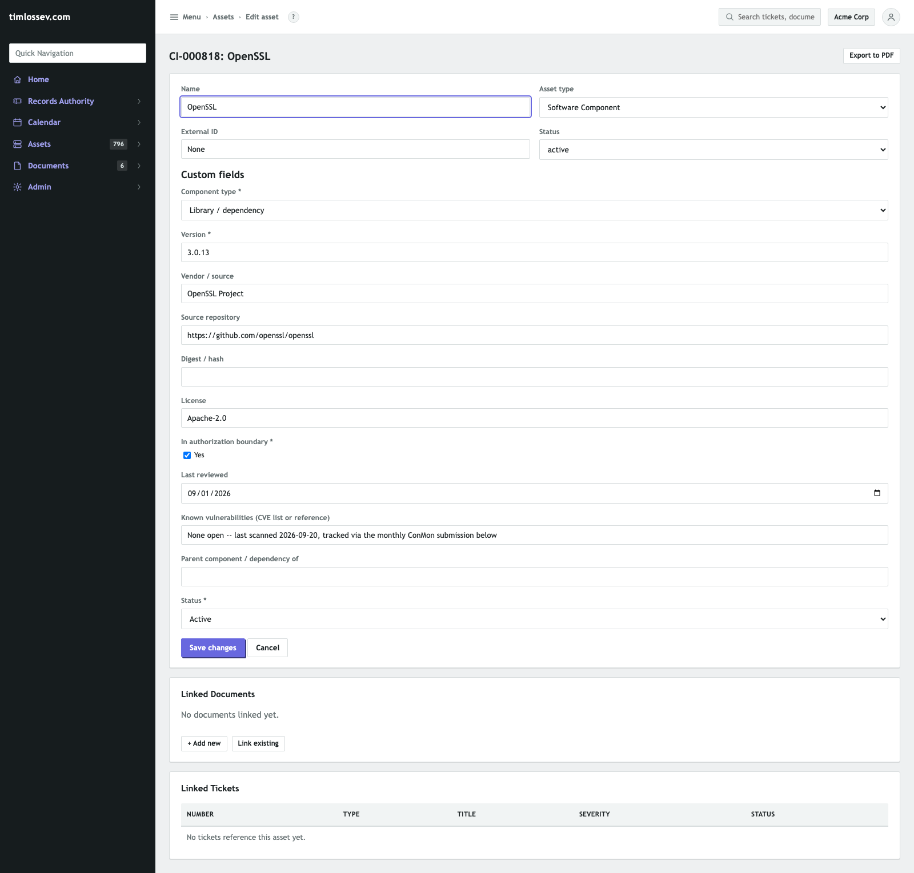
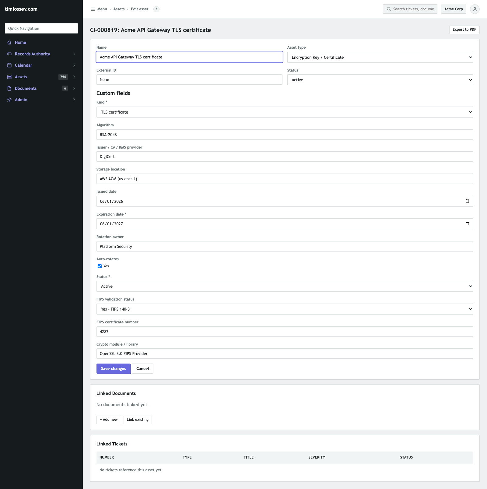
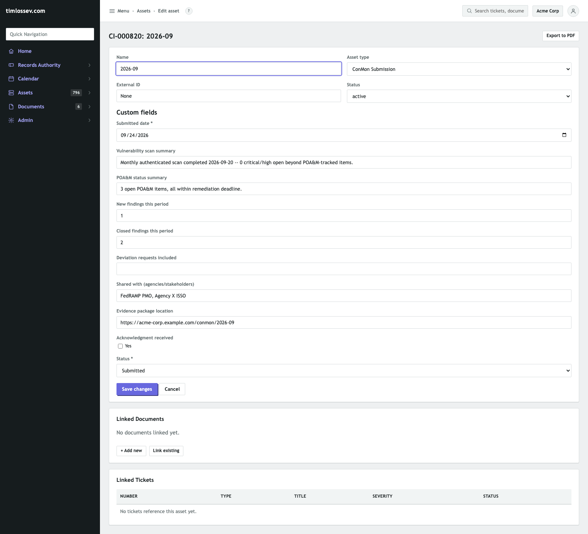

# CR26 coverage showcase: SBOM, cryptographic modules, and Continuous Monitoring

FedRAMP CR26 assessments (and the 3PAO readiness checklists built
around them) group review areas beyond Significant Change Notification
-- see [`docs/fedramp-cr26-showcase.md`](fedramp-cr26-showcase.md) for
that one -- into things like Vulnerability Detection & Response,
Inventory/SBOM, Cryptographic Modules, Collaborative Continuous
Monitoring, POA&M Management, Incident Reporting, and several others.
Most of those were already covered by existing RAIN capabilities
(vulnerability tickets, `poam-tracking-fields.rain`, incident tickets
and Platform Response Rules, the Certification Package templates).
Three weren't: Inventory/SBOM, Cryptographic Modules, and Collaborative
Continuous Monitoring. This walks through the three new templates that
close those gaps, against real data on a live instance -- the same
"one row per record, no code" pattern every other register in
`docs/compliance-templates/` already uses, nothing new to learn.

## 1. Inventory / SBOM

`software-inventory-register.rain` seeds a **Software Component** asset
type -- one row per in-scope application, library, container image, OS
package, or dependency:

Component type, version, vendor/source, source repository, digest/hash
(for a container image), license, whether it's in the authorization
boundary, when it was last reviewed, known vulnerabilities, and what
it's a dependency of. Distinct from `software-license-register.rain`
(procurement and renewal tracking) -- this register is about what's
actually *running*, not what's paid for.

## 2. Cryptographic modules

`encryption-key-cert-register.rain` already tracked key/certificate
lifecycle (algorithm, issuer, rotation owner, expiration, status).
Three fields added to it (2026-09-24, additive -- same non-breaking
extension `subprocessor-register.rain` got in 2026-09) cover the CR26
Cryptographic Modules review specifically:

**FIPS validation status** (a select, not a bare yes/no -- FIPS 140-2
and FIPS 140-3 are different generations of the same standard, and a
module can be validated under either, or pending, or not applicable),
**FIPS certificate number**, and **crypto module / library** (the
actual implementation, e.g. "OpenSSL 3.0 FIPS Provider" -- distinct
from "algorithm," since RSA-2048 says nothing about which validated
module performed the operation).

## 3. Collaborative Continuous Monitoring

`conmon-submission-register.rain` seeds a **ConMon Submission** asset
type -- one row per monthly package delivered to FedRAMP and
authorized agency customers:

Submitted date, a vulnerability-scan summary, a POA&M status summary,
new/closed finding counts, any deviation requests included, who it was
shared with, where the evidence package lives, whether acknowledgment
was received, and a status (Draft/Submitted/Acknowledged/Late). Give
it a schedule the same way [`docs/drift-detection-showcase.md`](drift-detection-showcase.md)
schedules a drift check: a Calendar entry on a monthly recurrence,
"Emit syslog event on occurrence" checked, an Event Promotion Policy
matching that event's `program` to open a reminder ticket -- the exact
same mechanism, already shown working end to end there, just pointed
at a different occurrence. Sharing the package itself is a Trust
Center document (any document flagged `is_shareable`) linked from the
submission row.

## Where this maps and where it doesn't

RAIN gets you: three more registers, in the same no-code pattern as
every other one here, closing three real CR26 review areas with
five-minute imports instead of from-scratch asset types.

RAIN doesn't: generate an SBOM (bring your own tool -- syft, trivy,
whatever already produces one; this is where the results land, same
"bring your own detection" boundary the syslog listener has for
security events). Validate a FIPS certificate against NIST's CMVP
database -- the certificate number is typed in from the actual
validation record, not looked up or checked. Submit a ConMon package
to FedRAMP or an agency, or generate the scan/POA&M summaries it
contains -- those come from the actual scanning/POA&M-tracking process
already in RAIN (Nessus import, `poam-tracking-fields.rain`) or
elsewhere; this register records that the monthly delivery happened
and what went into it, the same "record, don't automate the underlying
activity" boundary every register in this project has.

## Reproducing this

1. Admin > Config Bundles > Tenant > Import:
   `docs/compliance-templates/bundles/software-inventory-register.rain`,
   `bundles/conmon-submission-register.rain`, and (if not already
   imported) `bundles/encryption-key-cert-register.rain` -- importing
   it again over an existing one adds the three new FIPS fields
   without touching your existing rows.
2. Assets > New asset, pick the new asset type, fill in one row per
   component / crypto module / monthly submission.
3. Optional, for the ConMon register: Calendar > New entry, monthly
   recurrence, "Emit syslog event on occurrence" checked, Related
   document (the Trust Center package) if you want one linked; Records
   Authority > Event Promotion Policies, a policy matching that
   event's `program`, to open a reminder ticket each month.
