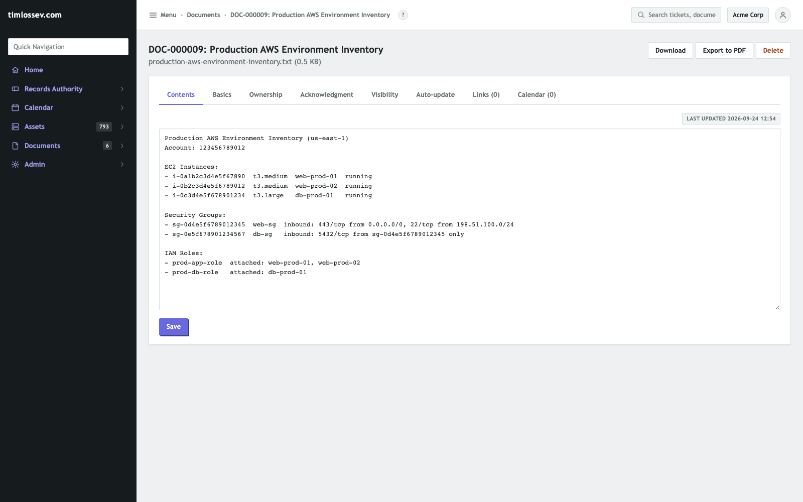
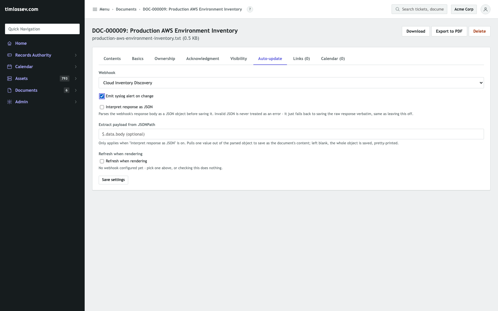
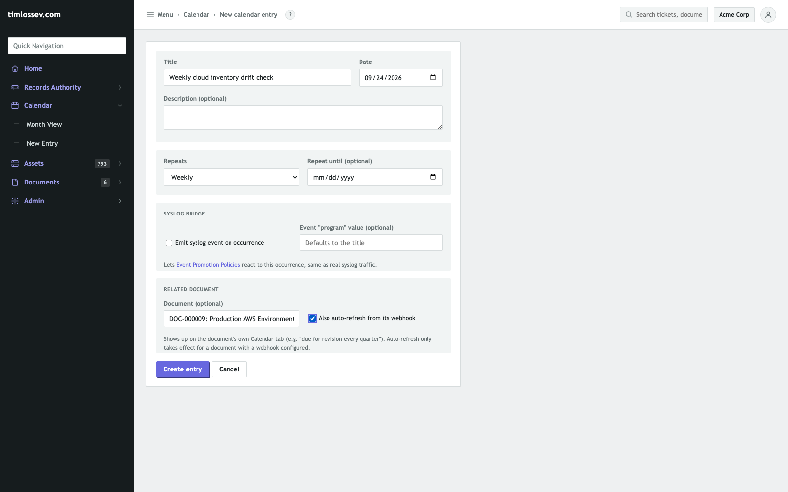
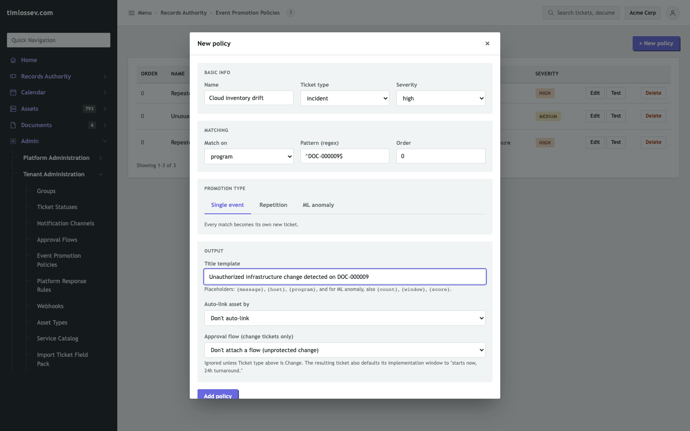
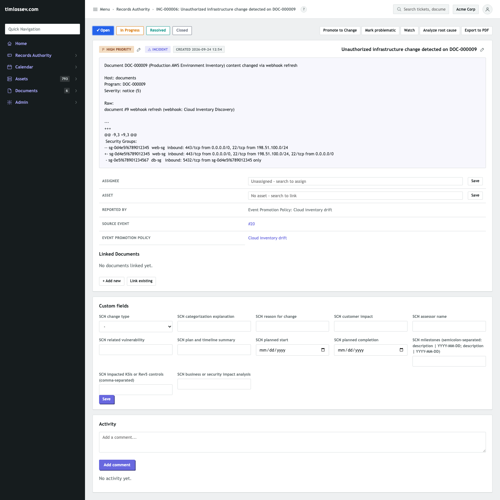

# Infrastructure drift detection showcase (SI-7 / CM-8(3))

Not a dedicated feature -- three existing capabilities, composed: a
webhook-populated document, a recurring calendar refresh, and an Event
Promotion Policy. No separate module, no extra code -- see
[`docs/architecture.md`](architecture.md#document-repository) for how
the three pieces are wired together internally. This walks through the
whole chain end to end against a live instance: a real baseline, a real
out-of-band infrastructure change, and the resulting ticket -- nothing
here is mocked up beyond the discovery tool itself (a real Terraform/
Terracognita pipeline costs real infrastructure to run; the point is to
show RAIN's own side of the wiring), screenshots included.

## 1. A baseline snapshot, as a document

A discovery pipeline (Terraform plus
[Terracognita](https://github.com/cycloid-community-catalog/terracognita)
or equivalent -- RAIN does not run this step) publishes its output
somewhere reachable over HTTP. The first snapshot is typed straight
into a plain-text Document to seed it:



Nothing special about this document yet -- it's the same Documents
feature every other register in this app uses. What turns it into a
drift monitor is the next tab.

## 2. Pointing it at the discovery output

A document's own **Auto-update** tab (next to Contents/Basics/
Ownership/...) is where "populate from webhook" actually lives -- not
document creation, a common enough mix-up that it's worth being
explicit about: pick a webhook (Admin > Webhooks, a plain "Generic"
one -- the discovery pipeline's own URL, `GET`, no payload needed), and
check **Emit syslog alert on change**:



Clicking "Refresh from webhook" the first time calls the pipeline's
endpoint and compares the response against what's stored. Here they're
identical -- the endpoint is echoing back the exact baseline just
typed in -- so it confirms the baseline and stops there: "Refreshed -
no change from webhook response," no alert, nothing promoted. That's
the correct behavior for a snapshot that hasn't actually drifted yet,
and it's the same comparison (`_content_changed`, line-based so a
trailing-newline artifact doesn't read as a false change) every later
refresh uses.

## 3. Scheduling the check

A **Calendar** entry gives that refresh a schedule -- recurrence,
Related document pointed at the monitor above, and "Also auto-refresh
from its webhook" checked:



This is what turns a one-off manual check into an unattended one: the
worker's calendar sweep runs hourly, and on any day this entry's
recurrence says is due, it calls the exact same refresh/diff/alert
logic the "Refresh from webhook" button calls by hand -- one
implementation of what a refresh means, regardless of what triggered
it. The rest of this walkthrough clicks that same button directly
rather than waiting out a real hourly sweep, which exercises the
identical code path the schedule would run unattended.

## 4. Turning a diff into a ticket

A diff alone is just a syslog event (`host="documents"`,
`program=<document's own number>`) sitting in the live feed until an
**Event Promotion Policy** reacts to it. Matching on `program` against
this one document's number scopes the policy to this one monitor:



One detail worth being precise about: the match is `re.search`, not a
full-string match, so an unanchored pattern like `DOC-000009` would
also match `DOC-0000091` or any other number containing that
substring. Anchoring it (`^DOC-000009$`, as configured here) is what
actually scopes a policy to exactly one document -- the earlier
version of this page didn't call that out.

## 5. Real drift, caught automatically

With everything wired up, the pipeline's endpoint reports a real
change: a security group gained an inbound rule that didn't go through
change management -- port 22 opened to the world, not just the VPN
range. Clicking "Refresh from webhook" again (the same call the hourly
sweep makes unattended) catches it immediately:

The document's stored content is overwritten with the new snapshot,
the diff is real and computed, not asserted, and because
`alert_on_change` is on, a syslog event carries it into
`evaluate_and_promote` the same as any network-ingested line would.
The policy from part 4 matches on `program` and promotes it straight
to a ticket:



The ticket's description is the actual captured event, not
reconstructed:

```
Document DOC-000009 (Production AWS Environment Inventory) content changed via webhook refresh

Host: documents
Program: DOC-000009
Severity: notice (5)

Raw:
document #9 webhook refresh (webhook: Cloud Inventory Discovery)

--- 
+++ 
@@ -9,3 +9,3 @@
 Security Groups:
-- sg-0d4e5f6789012345  web-sg  inbound: 443/tcp from 0.0.0.0/0, 22/tcp from 198.51.100.0/24
+- sg-0d4e5f6789012345  web-sg  inbound: 443/tcp from 0.0.0.0/0, 22/tcp from 198.51.100.0/24, 22/tcp from 0.0.0.0/0
 - sg-0e5f678901234567  db-sg   inbound: 5432/tcp from sg-0d4e5f6789012345 only
```

"Reported by: Event Promotion Policy: Cloud inventory drift," with the
source event and the policy itself both linked from the ticket's own
fields -- an assessor can trace a HIGH-priority incident straight back
to the exact diff that produced it, with nobody having had to notice
the change by hand first.

## Controls this supports

- **SI-7** (Software, Firmware, and Information Integrity) and
  **CM-8(3)** (Automated Unauthorized Component Detection): a scheduled
  discovery run against live infrastructure, diffed against the last
  snapshot, alerting automatically when they disagree -- exactly what
  parts 1-5 above walk through.
- Pairs with CM-2 (baseline -- the initial snapshot) and CM-3 (approval
  trail -- change tickets) to cover "every change was approved, and
  nothing else happened." See
  [`docs/itsm-controls-mapping.md`](itsm-controls-mapping.md) for the
  full control mapping.

## Starter template

[`docs/compliance-templates/cloud-environment-register.rain`](compliance-templates/cloud-environment-register.rain)
seeds a Cloud Environment asset type, for tracking which account or
environment each monitor covers.

## Where this helps, and where it doesn't

This catches the *undocumented* change -- the gap a baseline and an
approval trail can't cover by themselves, since both only ever see
what was recorded. It does not run Terraform, Terracognita, or any
discovery tool, and does not interpret the diff -- it stores whatever
text the pipeline produces and alerts on change, nothing more; reading
"is this diff actually a problem" is still a human's job, same as the
ticket in part 5 states the change but doesn't judge it. Detection is
on a schedule (the sweep is hourly, not real-time), not per-event.
Each monitor is one document, one webhook, one calendar entry, and one
policy -- there's no bulk "watch N environments" abstraction, so a
fleet of accounts means a fleet of these four pieces, one set per
account. And an unanchored Event Promotion Policy pattern will happily
match more documents than intended (see part 4) -- worth double-
checking on every policy this pattern is used for, not just this one.

## Reproducing this

1. Run a discovery tool against the environment on a schedule and
   publish its output somewhere reachable over HTTP.
2. **Documents > New document**, "Type new content" tab: type in the
   first snapshot as the baseline.
3. On the new document's own page, **Auto-update** tab: pick a
   (Generic) webhook pointed at the discovery endpoint, and check
   "Emit syslog alert on change."
4. **Calendar > New entry**: pick a recurrence, relate it to that
   document, and check "Also auto-refresh from its webhook."
5. **Records Authority > Event Promotion Policies**: a policy matching
   `program` against `^<the document's own number>$` (unique per
   document, so it only fires for this one monitor).
6. Wait for the next scheduled refresh (or click "Refresh from
   webhook" by hand) -- a real diff posts the alert and, if a policy
   matches, opens the ticket.
