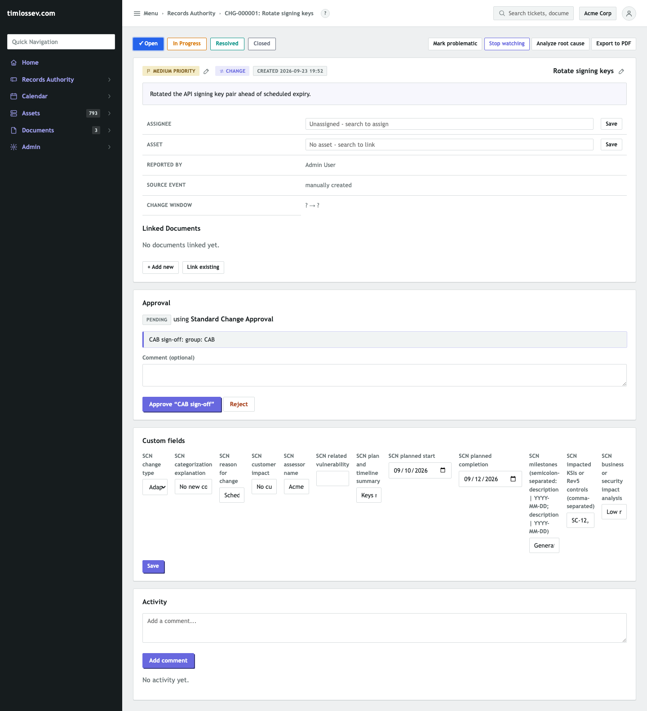

# FedRAMP CR26 primer: Significant Change Notifications in RAIN

FedRAMP's **Consolidated Rules for 2026 (CR26)** -- published June 24,
2026 -- fold the 20x pilot program's rules into one ruleset covering
how a certification is maintained, not just how it's granted.
Adoption became optional July 4, 2026; a certified provider must be
maintaining under CR26 by the first independent assessment that
begins on or after January 1, 2027. It applies to 20x Class B
certifications. Everything below about CR26 itself and the SCN rule
specifically is drawn from FedRAMP's own published rule text
([fedramp.gov/2026/reference/20x/b/significant-change-notification](https://www.fedramp.gov/2026/reference/20x/b/significant-change-notification/)),
not summarized from memory -- if FedRAMP revises the rule after this
was written, that page is the source of truth, not this one.

This isn't a general CR26 compliance guide -- `docs/itsm-controls-
mapping.md`'s Indirect Coverage section already covers the two other
big CR26-driven shifts (`poam-tracking-fields.rain` /
`fedramp-ocr-fields.rain` for the POA&M-to-OCR change, and
`fedramp-certification-package.rain` and friends for the Certification
Package Overview). This is a primer on one specific rule --
**Significant Change Notification (SCN)** -- worked all the way
through to a real, exported artifact, because it's the rule with the
clearest mapping onto something RAIN already models natively: a
Change ticket.

## What changed

CR26 replaces the old Significant Change **Request** process (submit,
wait for approval, then change) with a Significant Change
**Notification** process (evaluate, then notify -- not a request for
permission except for the most disruptive category). The generic
"30 days notice for any significant change" rule is gone; timing now
depends on which of three categories the change falls into,
self-determined by the provider under rule SCN-CSO-EVA:

| Category | What it covers | Notification |
|---|---|---|
| **Routine Recurring** | Day-to-day operations: patching, signature updates, capacity provisioning, firewall rule changes -- "routine care and feeding," no major availability impact, no executive approval needed | None required (rule SCN-RTR-NNR) |
| **Adaptive** | Irregular but contained: an OS upgrade with breaking changes, a multi-week feature rollout, a crypto module swap -- needs planning and verification but only minimal changes to security plans/procedures | One notice, within 10 business days **after completion** |
| **Transformative** | Rare, and changes the service's actual risk profile: a new third-party service, a management-plane replacement, a datacenter migration, a new AI capability touching customer data | Notice 30 business days **before** starting, another 10 days before, another within 5 days after completion, and a final one within 5 days after independent verification |

Every notification -- regardless of category, once one is required --
carries the same required fields under rule SCN-CSO-INF: which
Certification Package it's about, the change type and why it was
categorized that way, a description, the reason, customer impact, a
plan and timeline (with milestones), which controls or Key Security
Indicators the change touches, and a business/security impact
analysis. That field list is exactly what
`docs/compliance-templates/bundles/fedramp-scn-fields.rain` adds to RAIN's
Change tickets -- see `docs/compliance-templates/README.md`'s own
"Significant Change Notification export" section for the mechanics.

## The worked example

A CSP reconfigures its signing-key rotation -- narrow in scope, no new
components, but enough of a departure from routine patching to
warrant categorizing it as **Adaptive** rather than Routine Recurring.
In RAIN, that's just... a Change ticket:



`CHG-000001`, going through the same approval flow every other Change
ticket in this tenant does (CAB sign-off, still `PENDING` here), with
the SCN-specific fields filled in alongside RAIN's own built-in ones
-- change type `Adaptive`, the categorization reasoning, plan and
timeline, three dated milestones, and the two SC-12/SC-13 controls the
key-rotation procedure touches. Nothing about this required a
different workflow from any other change; it required eleven more
fields on the same ticket.

Exporting Tickets (Type = change, format JSON, `fedramp-scn-
export.jq` attached, `certification_package_overview_uri` edited in
once at the top of the file) alongside a second, mostly-blank change
ticket (`CHG-000002`, to show an incomplete one doesn't break the
batch) produced this, captured from the real downloaded file, nothing
retyped or reconstructed:

```json
[
  {
    "changeDescription": "Bump base image",
    "certificationPackageOverviewUri": "https://acme-corp.example.com/fedramp/certification-package-overview"
  },
  {
    "changeDescription": "Rotated the API signing key pair ahead of scheduled expiry.",
    "certificationPackageOverviewUri": "https://acme-corp.example.com/fedramp/certification-package-overview",
    "changeType": "Adaptive",
    "changeTypeExplanation": "No new components or trust boundaries introduced.",
    "reason": "Scheduled key rotation per policy.",
    "customerImpact": "No customer-visible downtime expected.",
    "assessorName": "Acme 3PAO",
    "impactAnalysis": "Low risk, reversible change.",
    "impactedControls": ["SC-12", "SC-13"],
    "planAndTimeline": {
      "summary": "Keys rotated during a maintenance window with rollback plan.",
      "plannedStart": "2026-09-10",
      "plannedCompletion": "2026-09-12",
      "milestones": [
        { "milestoneDescription": "Generate new keys", "targetDate": "2026-09-10" },
        { "milestoneDescription": "Cutover", "targetDate": "2026-09-11" },
        { "milestoneDescription": "Revoke old keys", "targetDate": "2026-09-12" }
      ]
    }
  }
]
```

`certificationPackageOverviewUri` lands on *every* object, not just
the filled-in one -- it's a per-CSP constant the transformer adds
unconditionally once it's edited in, the same value regardless of
which ticket it's attached to. The first object -- `CHG-000002`, the
minimal one -- is exactly what a change nobody's categorized yet
looks like: still exportable, missing everything optional,
`changeType` absent rather than the whole ticket vanishing from the
batch (a real bug this transformer had until it was fixed and covered
by a regression test -- see `docs/architecture.md`'s own note on it).
Checked against FedRAMP's own published schema with the real
`jsonschema` library (fetched live from fedramp.gov, not a cached or
hand-copied file) -- the first object correctly fails validation
(`'changeType' is a required property`, exactly what "nobody's
categorized this yet" should mean), the second validates cleanly.

## Where this maps and where it doesn't

RAIN gets you: the register (every change lives as a ticket you were
already going to create), the required fields, the approval trail
(CAB sign-off before the change ships, already wired to RAIN's
existing Change-ticket approval flows), and a standardized export any
time you want one.

RAIN doesn't: categorize the change for you. SCN-CSO-EVA requires the
provider to evaluate and categorize every change -- that's a judgment
call `scn_change_type` records, not one RAIN makes. It doesn't enforce
the notification-timing deadlines in the table above (a Transformative
change's "30 business days before starting" could be modeled as a
ticket due date or a Calendar entry if you want RAIN to remind you,
but nothing here does that automatically yet). And it doesn't submit
anything to FedRAMP -- SCN-CSO-NOM governs the actual notification
mechanism to FedRAMP and affected agencies, which is a submission
process this export feeds, not replaces.

## Reproducing this

1. Admin > Config Bundles > Tenant > Import:
   `docs/compliance-templates/bundles/fedramp-scn-fields.rain`.
2. Records Authority > New ticket, type Change, fill in the SCN fields
   alongside the usual title/description/approval flow.
3. Edit `docs/compliance-templates/transforms/fedramp-scn-export.jq`'s own
   `certification_package_overview_uri` constant once, then Records
   Authority > Export: Type change, format JSON, attach the edited
   file under "JSON transform (optional)".
