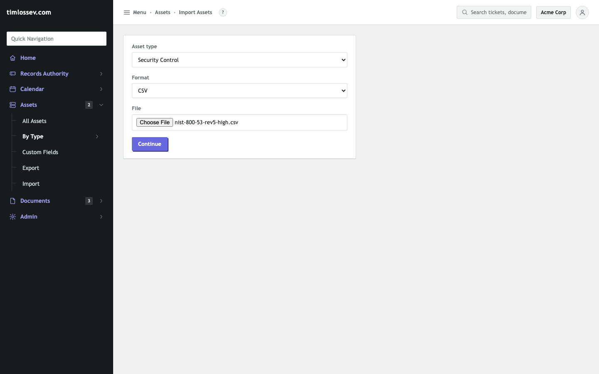
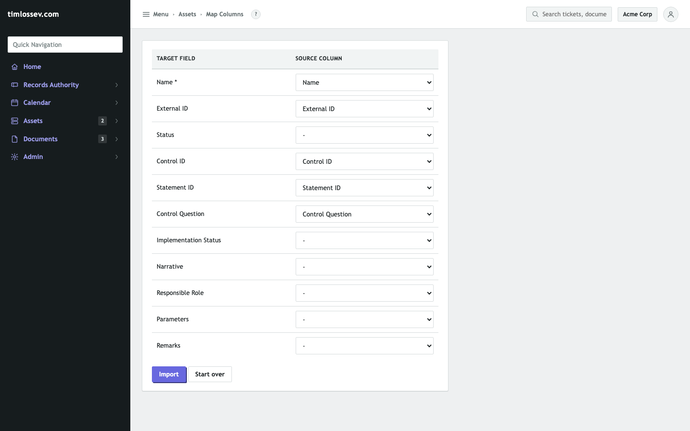
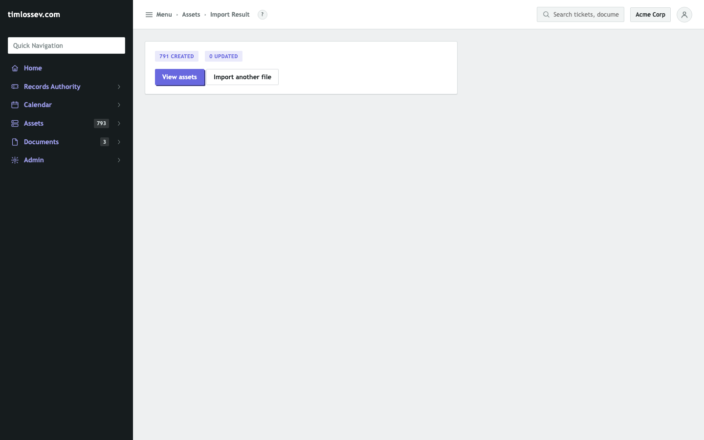
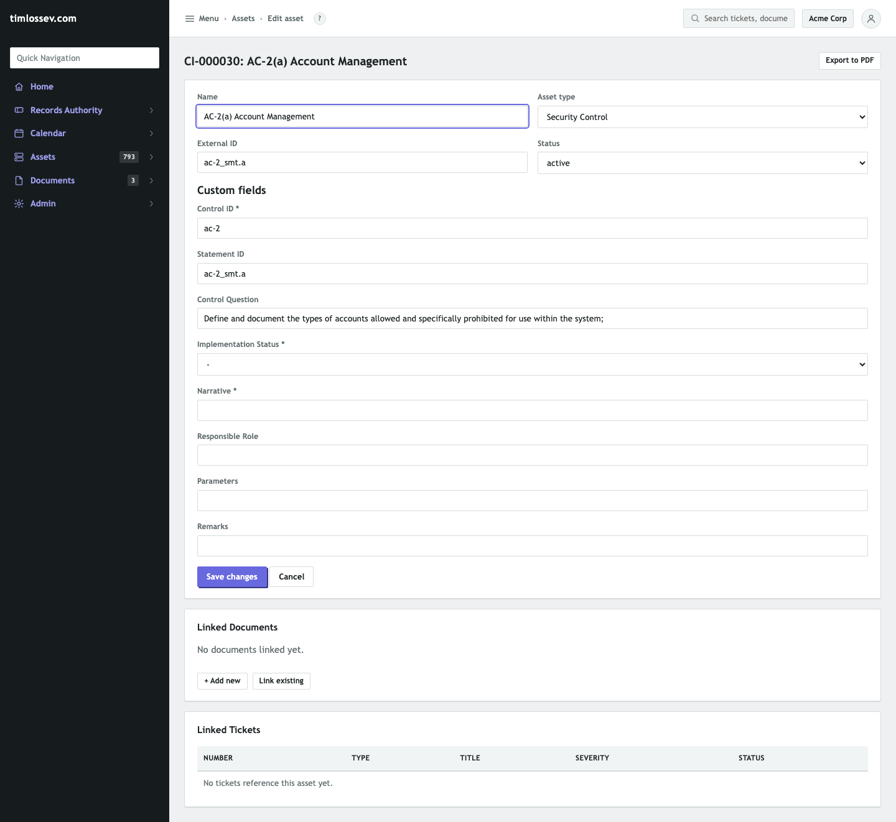
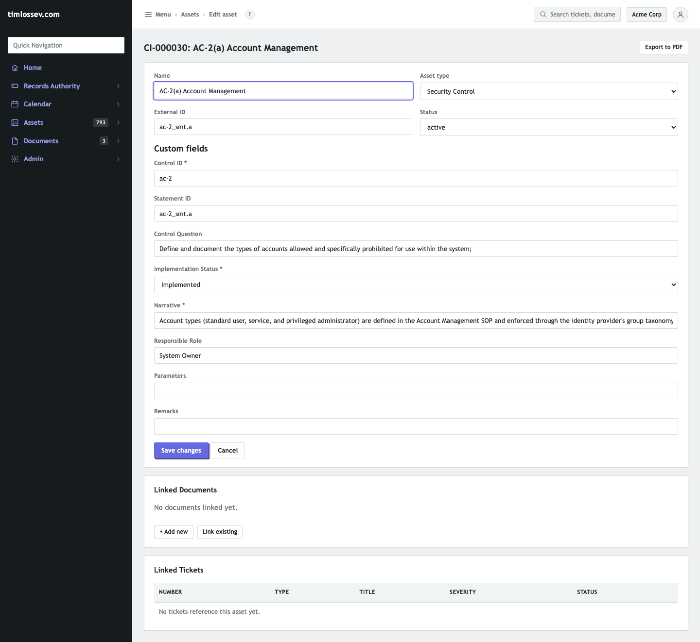
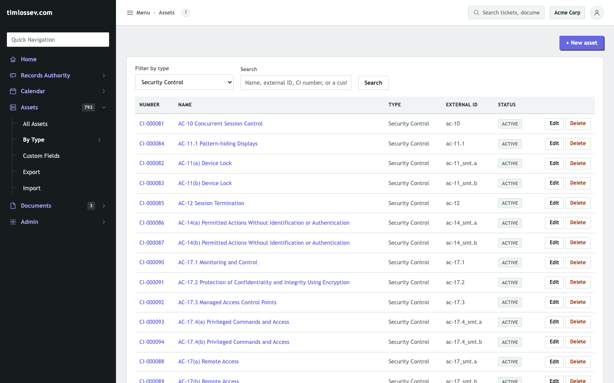
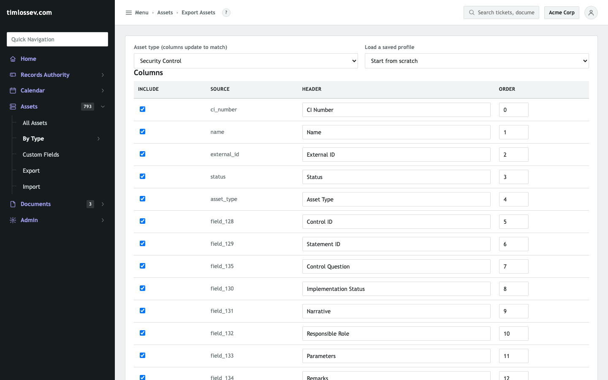

# OSCAL SSP control-implementation showcase

A System Security Plan's control-implementation section is, at its
core, a big population of questions -- one (or several) per control:
*how is this actually done here?* Most teams either track that in a
spreadsheet that drifts from reality, or pay for a dedicated GRC
platform to manage it. This walks through doing it in RAIN instead,
using the actual FedRAMP Rev 5 High baseline as the example -- import
the real control set, answer some of it, export standardized OSCAL
evidence, all against a live instance. Nothing here is mocked up.
See [`docs/compliance-templates/README.md`](compliance-templates/README.md)
for the underlying files and
[`docs/architecture.md`](architecture.md)'s "OSCAL control-implementation
export" note for how the transformer itself works.

## 1. Import the baseline as your control register

`docs/compliance-templates/security-control-register.rain` seeds a
Security Control asset type (Control ID, Statement ID, Control
Question, Implementation Status, Narrative, Responsible Role,
Parameters, Remarks). `docs/compliance-templates/nist-800-53-rev5-high.csv`
is the real FedRAMP Rev 5 High baseline, parsed directly from
[oscal-compass/compliance-trestle-fedramp](https://github.com/oscal-compass/compliance-trestle-fedramp)'s
own resolved OSCAL catalog XML -- 791 rows: one per FedRAMP
"response-point" (the exact spots FedRAMP's own catalog marks as
needing an SSP author's answer), covering all 410 controls and
enhancements in the baseline. Low and Moderate ship the same way
(424 and 688 rows).



Asset type Security Control, format CSV, the baseline file attached.
The column-mapping screen auto-suggests every target field from the
CSV's own headers (Name, External ID, Control ID, Statement ID,
Control Question all matched automatically) since they're exactly
this asset type's own field labels:



```
791 CREATED   0 UPDATED
```



One request, a few seconds, the entire baseline is now a real,
browsable register -- no per-row form-filling to get there.

## 2. Work the register

Each row is an ordinary Asset, so answering one is the same "click
Edit, fill in the field, Save" as anything else in RAIN. Before:



`Control Question` came straight from the baseline: "Define and
document the types of accounts allowed and specifically prohibited
for use within the system." `Implementation Status` and `Narrative`
are required fields left blank by the import on purpose -- the point
of shipping the question list is that nobody can pre-fill the answer.
After:



Status `Implemented`, a real narrative, a responsible role. Six more
were answered the same way across AC, AU, CP, IA, SC, and SI --
spanning six of the eighteen 800-53 families -- including one marked
`Partially Implemented` (SC-7(a), boundary protection: implemented,
but the exception inventory is still being reconciled) to show status
tracking isn't just a binary "answered or not."

## 3. Browse and assign at scale

Assets > Export lets you page through the whole register, but so does
the plain Assets list, filtered to the type:



793 assets in this tenant, filtered down to exactly the 791 controls
(plus 2 unrelated demo assets from earlier in this session). Every
column already in RAIN applies here for free: search by Control ID or
title, assign an owner, link a control to the ticket that tracks
remediating a gap in it, attach supporting evidence as a linked
Document, flag one overdue for review. None of that is
control-register-specific code -- it's the same Asset machinery every
other register in `docs/compliance-templates/` already gets.

## 4. Export standardized evidence, any time

Assets > Export, format JSON, the `oscal-control-implementation.jq`
transformer attached:



The result is a real OSCAL `control-implementation` fragment built
from all 791 rows -- 410 `implemented-requirements`, one per control,
each with a schema-valid, globally-unique `uuid`. A control answered
at the whole-statement level exports flat; `ia-2.1` (Multi-factor
Authentication to Privileged Accounts), answered above, came out as:

```json
{
  "uuid": "00000000-0000-4000-8000-000009000347",
  "control-id": "ia-2.1",
  "props": [
    { "name": "implementation-status", "value": "implemented" }
  ],
  "description": "All privileged accounts authenticate via the corporate SSO provider with TOTP-based MFA enforced at the identity provider; break-glass accounts use hardware security keys stored in a sealed physical safe with dual-custody access logging.",
  "responsible-roles": [ { "role-id": "isso" } ]
}
```

A control tracked at the lettered-part level nests every part into a
`statements` array instead -- `ac-2` (Account Management) has twelve
parts (a through l); only `ac-2_smt.a` has been answered so far, and
the fragment says exactly that rather than pretending otherwise:

```json
{
  "uuid": "00000000-0000-4000-8000-000009000030",
  "control-id": "ac-2",
  "props": [ { "name": "implementation-status", "value": "implemented" } ],
  "statements": [
    {
      "statement-id": "ac-2_smt.a",
      "uuid": "00000000-0000-4000-8000-000000000030",
      "description": "Account types (standard user, service, and privileged administrator) are defined in the Account Management SOP and enforced through the identity provider's group taxonomy; only these three types may be provisioned in any environment."
    },
    { "statement-id": "ac-2_smt.b", "uuid": "00000000-0000-4000-8000-000000000031", "description": "" },
    { "statement-id": "ac-2_smt.c", "uuid": "00000000-0000-4000-8000-000000000032", "description": "" }
  ]
}
```

An unfinished register isn't a blocker to exporting -- it's a
snapshot of real progress (7 of 410 controls answered, in this
example), re-exportable at any point as the team works through the
rest. That fragment still isn't a complete `system-security-plan` --
metadata, system-characteristics, and system-implementation need
authoring separately, same scope note as everywhere else this feature
is documented -- but it's the part that's actually most of an SSP's
bulk, generated from data your team was already going to have to
enter somewhere.

## Where this stands next to a dedicated GRC tool

What's here for free: a real control register at baseline scale,
per-control ownership and status tracking, evidence linking (tickets,
documents), audit history on every field change (RAIN's activity
feed), and standardized machine-readable export -- for a system you're
very likely already running for tickets and assets, not a separate
platform with its own users, permissions, and integrations to
maintain.

What a dedicated GRC platform adds that this doesn't try to replace:
cross-framework control mapping (one answer satisfying multiple
frameworks' overlapping requirements automatically), continuous
control monitoring wired to live infrastructure state, workflow/
approval chains specific to assessment cycles, and polished
assessor-facing reporting. If those are must-haves, RAIN's own register
is still a reasonable source of record to feed one -- the OSCAL export
is exactly that hand-off format.

## Reproducing this

1. Admin > Config Bundles > Tenant > Import:
   `docs/compliance-templates/security-control-register.rain`.
2. Assets > Import: asset type Security Control, format CSV,
   `docs/compliance-templates/nist-800-53-rev5-high.csv` (or `-low`/
   `-moderate` for a smaller baseline).
3. Answer as many rows as you're ready to -- Assets > (filter to
   Security Control) > Edit each one.
4. Assets > Export: format JSON, attach
   `docs/compliance-templates/oscal-control-implementation.jq` as the
   transform (upload it directly, or save it as a `.jq` Document first
   to reuse it on every future export).
