# Screenshots

Captured against a local RAIN instance (`docker compose up`), with the
runtime branding, accent color, and font set from the setup wizard --
nothing here is mocked up.

## Records Authority (tickets)

| | |
|---|---|
| 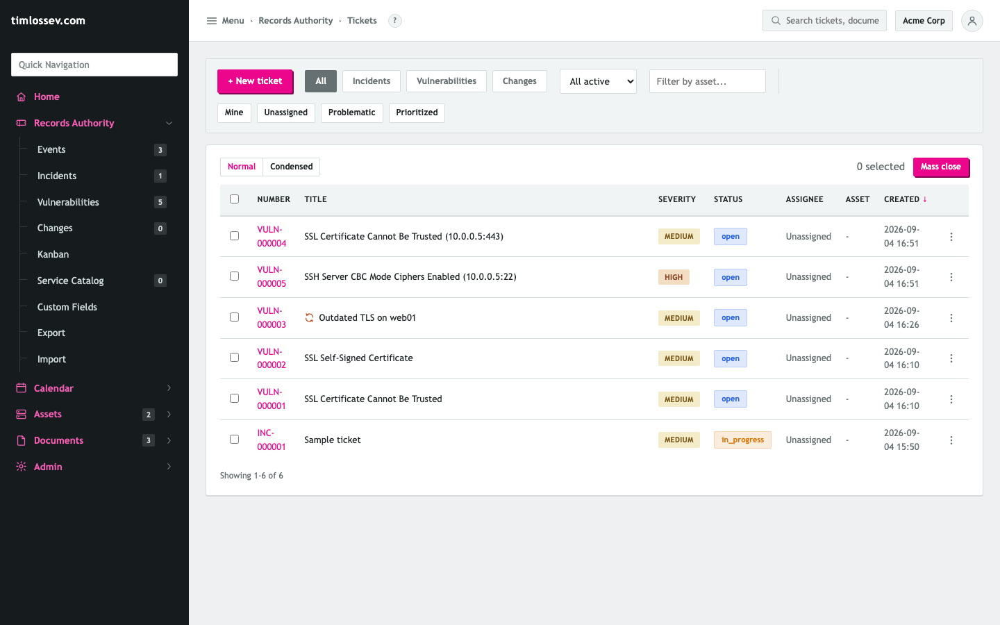 Ticket list, filtered and sorted, with quick-filter chips and a three-dot action menu per row. | 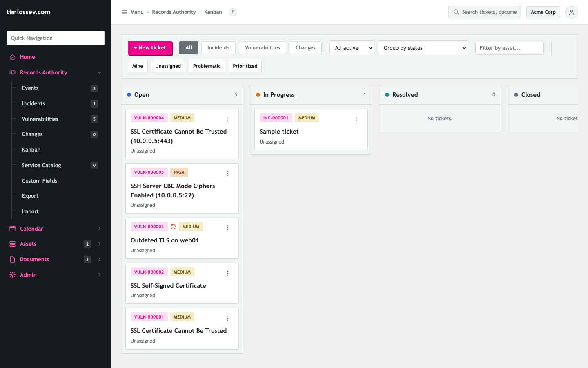 The same tickets on a Kanban board, grouped by status or by assignee workload. |
| 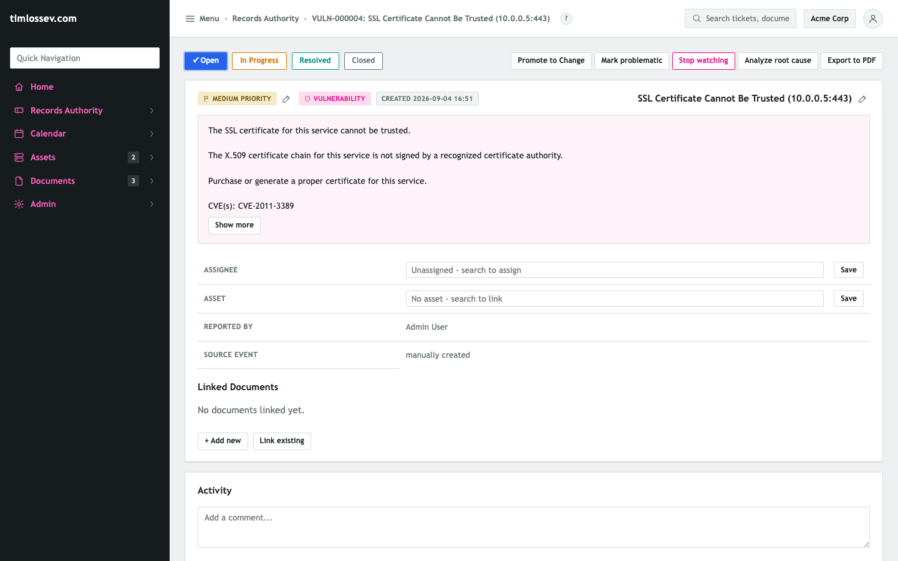 A single ticket: status stepper, quick actions, and the full activity feed. | 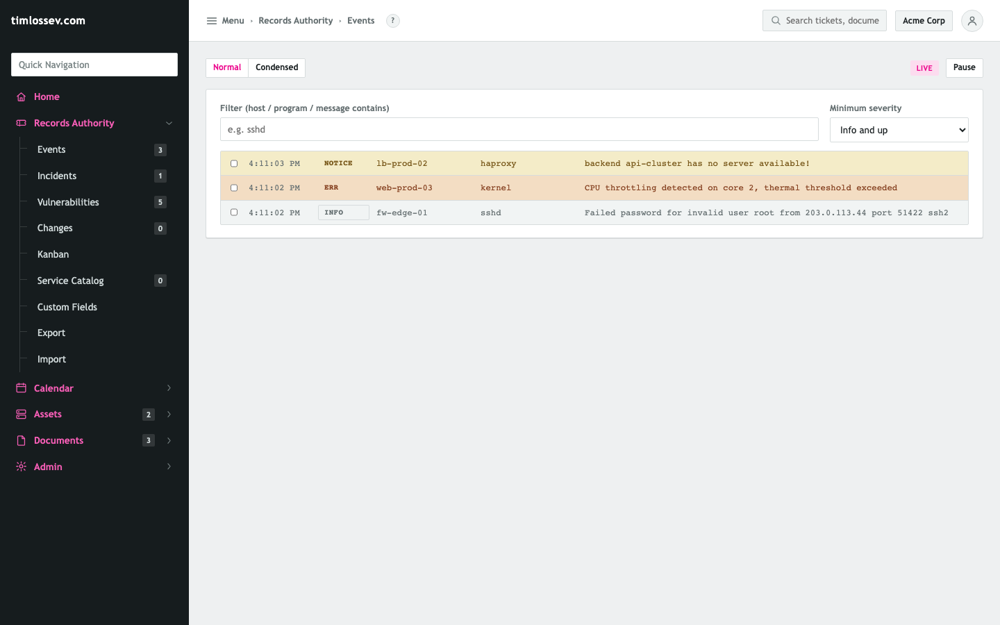 The live syslog feed -- CEF/JSON/key=value auto-detected, filterable by severity. |

## Automation

| | |
|---|---|
|  Event Promotion Policies turn matching syslog events into tickets automatically. | 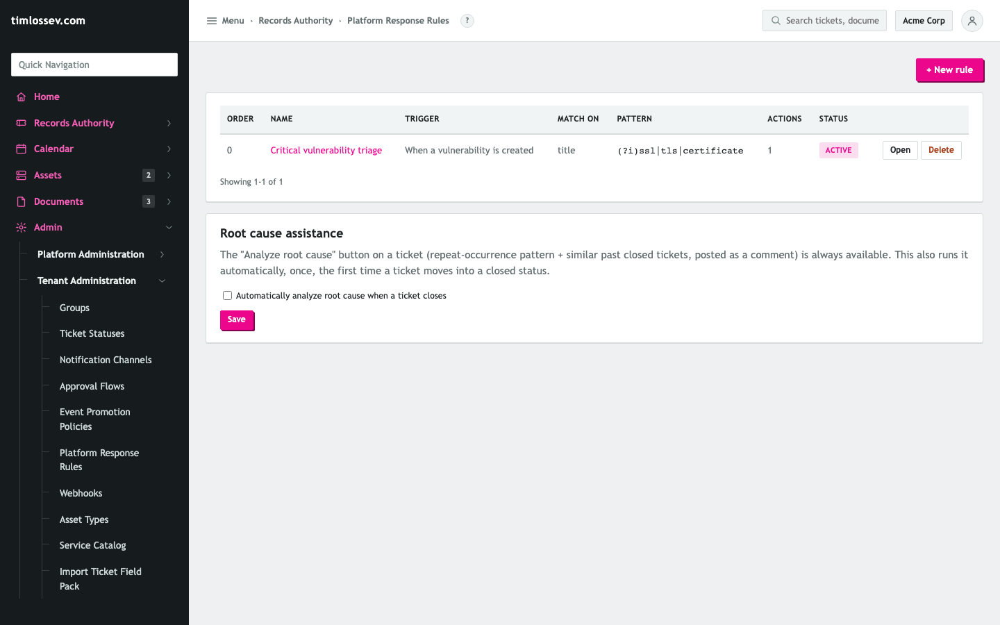 Platform Response Rules react to ticket lifecycle events -- notify, tag, escalate. |

## Assets, documents, calendar

| | |
|---|---|
| 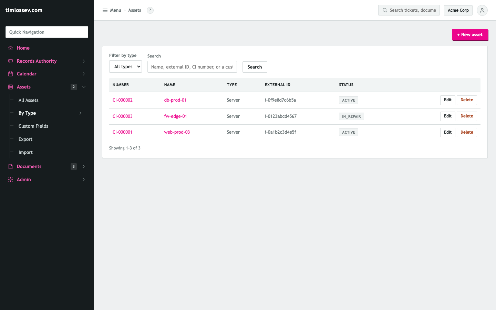 The asset registry, with no-code custom fields per type. | 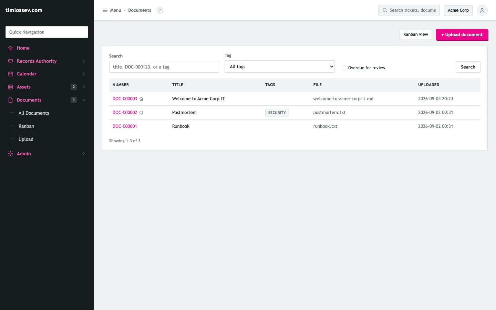 The document repository, with tags and status flags. |
| 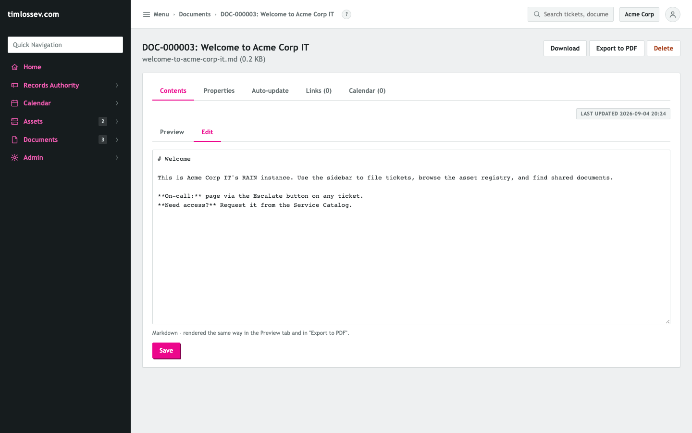 A document's own page -- properties, contents, links, calendar. | 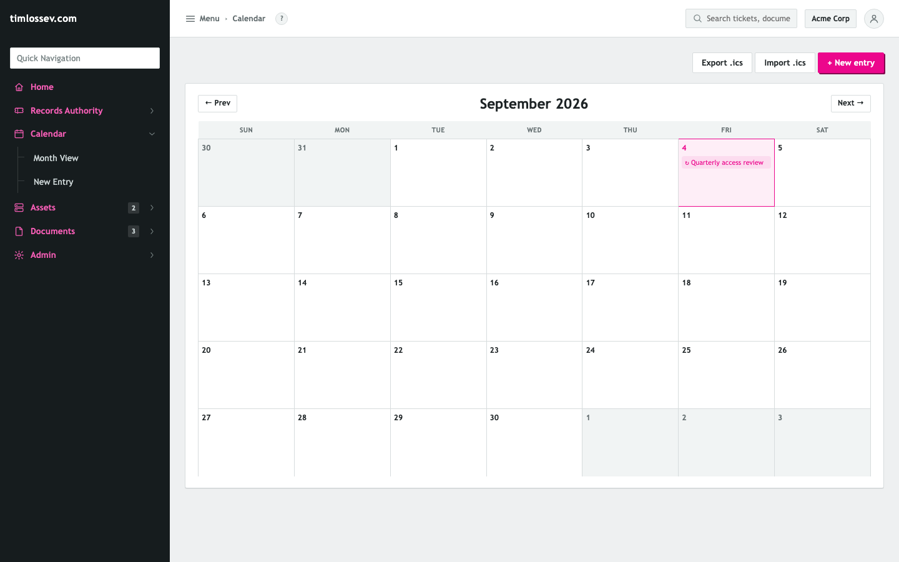 The per-tenant calendar, with recurring entries and a syslog bridge. |

## Search, portal, admin

| | |
|---|---|
| 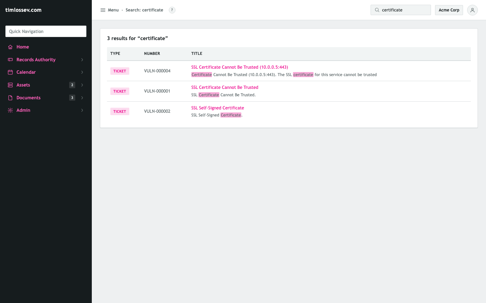 Global full-text search across tickets and documents. | 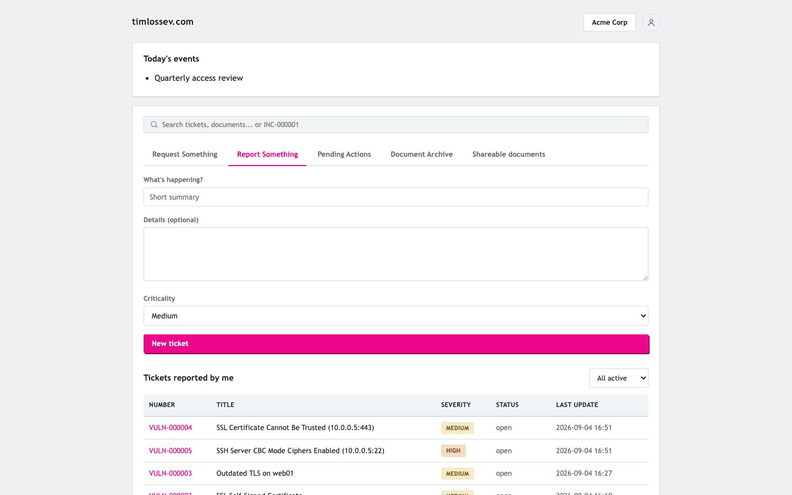 The public client portal -- file a request with no account. |
| 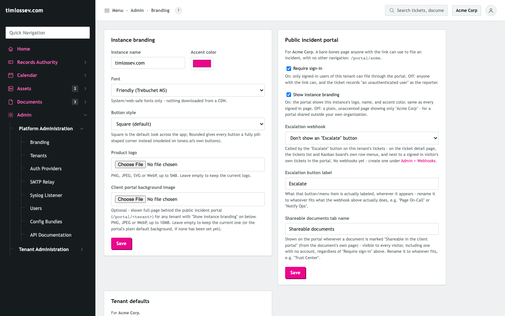 Runtime branding and the public-portal settings, no redeploy needed. | 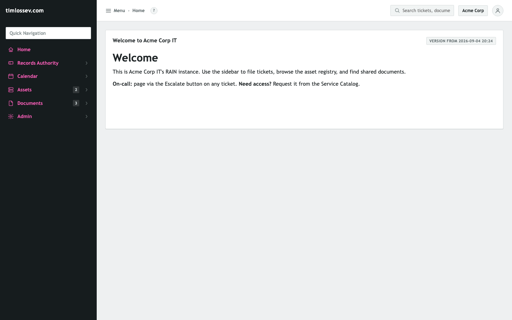 The landing page, driven by a flagged document. |

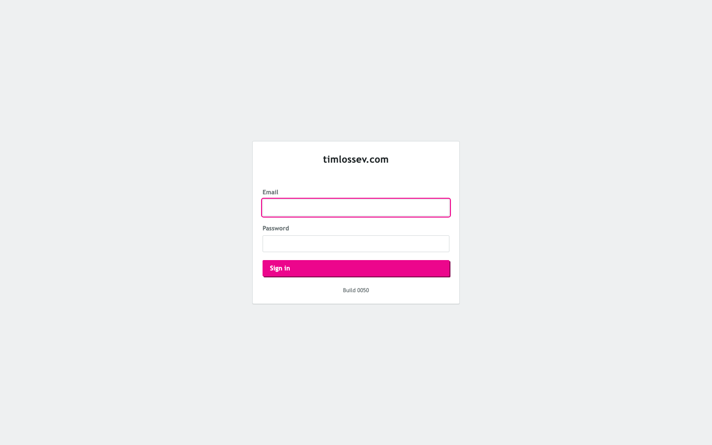

Sign in -- local, LDAP, and SAML accounts all use this same form.
